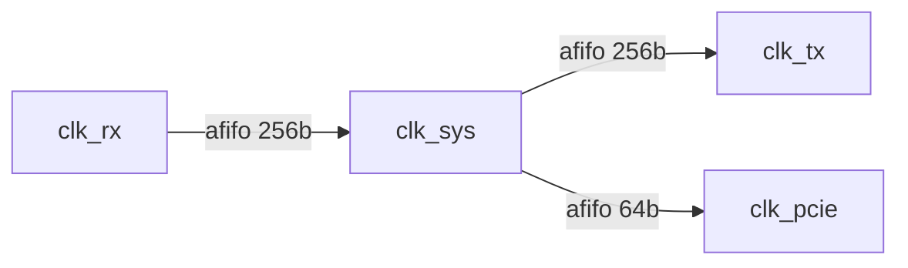

# FPGA 架构设计与模块划分

从规格到可实现层次时用本 skill。先出架构，再写 RTL。编码风格走 [FPGA RTL Style](sand-workflow:fpga-rtl-style)；CDC 审计、XDC、时序闭合不要塞进这里。

目标交付是一份**能开工的划分**，不是论文框图。没有吞吐/延迟/时钟/接口数字时，先列假设再往下拆，不要空画框。

## 铁律

1. **边界先于内部。** 先定时钟域、复位、流契约，再拆算法。
2. **一个模块一个时钟、一种职责。** 跨时钟只允许出现在命名过的桥模块。
3. **契约可仿真。** 每个箭头都是 valid/ready、AXI、或带时间预算的 IO，禁止“内部看看再定”。
4. **延迟必须可加。** 每级流水给出拍数；总延迟 = 各级之和 + 桥/FIFO 最坏占用。不要用综合过当签核。
5. **权衡写在纸上。** 面积 vs 延迟 vs 跨时钟无法两全时给 2～3 个方案，停手等人选。

## 流程（按顺序，不要跳）

### 1. 钉规格

写成一张表，缺的用显式假设填上：

| 项 | 必须写清 |
|----|----------|
| 线侧/主机接口 | 协议、位宽、线速、时钟从哪来 |
| 吞吐 | 每秒消息/拍，能否接受 ready 拉低 |
| 延迟 | 从入口 fire 到出口 fire 的目标拍数或 ns |
| 时钟 | 主频、派生钟、GT/PCIe 独立钟 |
| 存储 | 要不要表项、深度、要不要双口/ECC |
| 复位 / 配置 | 谁来、是否运行中可改 |

吞吐对不上线宽时，先算 `bits_per_beat * f_clk`，不够就加并行或升钟，不要开始画 FSM。

### 2. 切开数据面 / 控制面

- **数据面：** 每拍都可能动的路径（解析、查表、运算、组包）。要短、要寄存边界、禁止塞进 CPU 式状态机。
- **控制面：** 稀有事件（配置、统计、异常、寄存器）。用 AXI-Lite / 内部 CSR，不要让控制握手堵数据面。
- 两边交互只允许：配置影子寄存器（准静态）、状态计数、暂停/清空。禁止控制面组合改数据通路关键路径。

### 3. 时钟域图

先画钟，再画框。

- 每个物理/逻辑时钟一个域：`clk_sys`、`clk_rx`、`clk_tx`、`clk_pcie`…
- 域与域之间只画 **一种** 桥：2FF（1 bit）、灰码 FIFO、req/ack 选通、厂商 clock converter。
- 10G/以太网 与 PCIe **默认不同域**，即使频率碰巧相近。
- 输出：时钟表（名、周期、来源）+ 桥清单（信号或总线、宽度、机制）。

缺钟定义 = 后面划分作废，停下来补。

### 4. 层次（只许这三层）

```
<ip>_top          接线、时钟/复位分配、IO/GT/IP 壳、跨时钟桥实例
  ├─ <ip>_core    单时钟数据面顶：把功能块串起来，不含第二种钟的运算
  │    ├─ 功能块   解析 / 查表 / 运算 / 调度 … 各一块
  │    └─ 叶子     计数、仲裁、skid、同步 RAM 包装、2FF
  └─ 桥 / 壳       afifo、PCIe/MAC IP、复位同步
```

**`_top` 必做：** 端口、`create` 时钟入口、复位同步、跨域桥、厂商 IP。  
**`_top` 禁止：** 深组合、推断 RAM/DSP、业务 FSM、第二个域的算术。

**`_core` 必做：** 单时钟把功能块用显式流接好；统一 backpressure。  
**功能块：** 一种算法或一种协议阶段，入口出口都有契约。  
**叶子：** 可复用、无业务语义；CDC/FIFO 不准复制粘贴，只实例化。

拆模块的判据（满足一条就该拆）：

- 不同时钟
- 不同复位域
- 需要独立仿真（协议解析 vs 表项 vs 策略）
- 资源核（BRAM/URAM/DSP/GT）要单独包装才能约束
- 流水级已经超过“一眼能数完的组合深度”，要按级切开

不要为了“好看”把 20 行算术拆成 5 个文件。

### 5. 接口契约

每个箭头一张卡：

| 字段 | 例 |
|------|-----|
| 名字 | `par2lkp` |
| 方向 | 解析 → 查表 |
| 时钟 | `clk_sys` |
| 协议 | AXI-Stream 或 `valid/ready` + `data/keep/last` |
| 位宽 / 每拍消息数 | 256b，1 消息/拍 |
| 反压 | ready 可组合看下一级；过长则插 register slice |
| 延迟预算 | 本段 3 拍 |

规则：

- 流式用 valid/ready（或 AXIS）。禁止隐式“永远 valid”。
- `fire = valid && ready`。数据只在 fire 时被取走。
- ready 链过长就在边界插 skid，不要让 ready 穿 4 个功能块组合回走。
- 跨层次总线在父模块命名 `src2dst_*`，端口仍用 `s_*` / `m_*`。

### 6. 流水与延迟预算

对数据面画级：

1. 按组合深度粗切（查表、比较树、哈希各一级）。
2. 给每级预算拍数；写出 **旁路/停顿** 是否插入气泡。
3. 总延迟 = Σ 级延迟 + FIFO 占用（写最坏，不写“平均差不多”）。
4. 需要 cut-through 的路径与需要 store-and-forward 的路径分开画，不要混在一个 FIFO 语义里。

面积紧时优先：减并行 → 加深流水（加延迟）→ 升钟。不要默默砍功能。

### 7. 存储与核

- 表项/包缓存单独成模块，端口只暴露简单双口或 AXI。
- 谁拥有写、谁拥有读，画在图上；禁止两个功能块直接打同一套 BRAM 口。
- 初始化（清表）是独立小引擎，不要绑在数据面 FSM 里。

### 8. 复位与配置

- 每时钟域：异步置位、同步释放的复位树，在 `_top` 里完成。
- 运行中可改的配置：打一拍影子寄存器再进数据面；标注“准静态”，后面才允许 false path 类约束。
- 全局 flush：定义空管条件（FIFO empty + 流水 valid 全 0），作为可仿真检查。

### 9. 输出（缺一不可）

用下面格式一次交齐。先架构后代码；用户没要 RTL 就不要生成整文件。

1. **假设清单**（规格缺口）
2. **时钟域图**（mermaid `flowchart`，节点=域，边=桥类型）
3. **模块树**（top / core / 功能块 / 叶子，各一行职责）
4. **数据面连接图**（模块 + 命名流）
5. **接口表**（第 5 节那张卡，每个箭头一行）
6. **延迟预算**（拍或 ns，注明含不含 IO/MAC）
7. **文件清单**（准备创建的 `.sv` 名，仍不必写满代码）
8. **未决权衡**（最多 3 条，带选项）

时钟域图模板：



模块树模板：

```
foo_top          clk 分配, MAC/PCIe 壳, 复位同步, 两只 afifo
foo_core         clk_sys 数据面
  foo_parse      协议切片, 3 拍
  foo_lookup     表查, 2 拍, 独占 BRAM
  foo_emit       组包
cdc_afifo_*      灰码指针, 跨域
```

## 常见场景怎么切（选最接近的套，再改数字）

**流处理（包/行情切片）：** MAC/RX 域 → afifo → parse → lookup/filter → emit → afifo → TX。parse 与 lookup 分开，方便单独测协议。

**主机 + 加速器：** PCIe/DMA 一域，核逻辑一域，用 DMA 描述符 + 数据 FIFO 桥；CSR 走 AXI-Lite，不进数据 FIFO。

**多通道：** 通道引擎实例化 N 次，前面用 arb/dearb；共享表必须单写者或显式仲裁模块。

不要把“策略/订单簿/MAC”揉进一个 `misc` 模块。

## 停手条件

- 钟没定义清
- 吞吐算不过来还在拆 FSM
- 两个功能块抢同一 BRAM 且没仲裁
- 跨时钟画在了运算模块内部
- 延迟目标与流水级明显矛盾，还没给选项

此时只输出第 8 项权衡，不编造一份“看起来完整”的假图。
